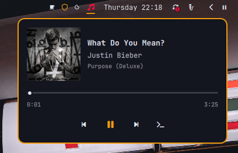
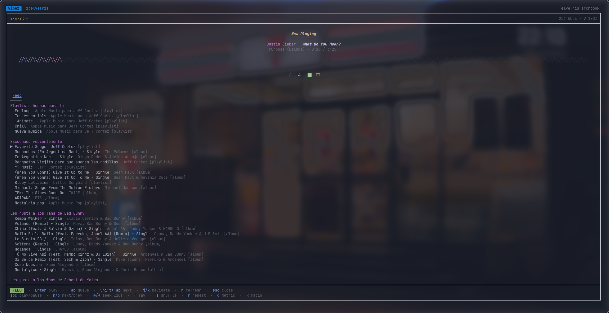

# Omarchy Vibez

Apple Music from [`vibez`](https://github.com/simonepelosi/vibez), seamlessly integrated into the Omarchy status bar.

**Omarchy Vibez** is a native Omarchy shell plugin that reads the MPRIS player exported by [`vibez`](https://github.com/simonepelosi/vibez). It provides a theme-aware bar widget with now-playing metadata, album art, interactive seekable progress bar, and media transport controls, while keeping the full `vibez` TUI accessible in a persistent terminal session.





---

## ✨ Features

- 🎵 **Now-Playing Status**: Displays track title, artist, album, and live playback status in the Omarchy bar.
- 🖼️ **Album Art & Metadata**: Clean popup with album cover preview, title, artist, and album name.
- ⏱️ **Seekable Progress Bar**: Interactive time slider with elapsed and total duration timestamps (`mm:ss`).
- ⏯️ **Transport Controls**: Previous, Play/Pause, Next, and Open TUI buttons.
- 🔄 **Mouse Wheel Track Switching**: Scroll on the bar icon to skip forward or backward between tracks.
- ⚡ **IPC Support**: Full CLI and keybind control via `omarchy ipc io.github.jeffcortez23.omarchy-vibez <action>`.
- 🪟 **Persistent Terminal Session**: Uses `tmux` in the background so closing your terminal window never interrupts playback.
- 🎨 **Adaptive Omarchy Theming**: Automatically matches your active Omarchy theme colors and typography.
- ⚙️ **Configurable**: Optional in-bar label, customizable click actions, scroll actions, and idle hiding.

---

## 📋 Requirements

1. **Omarchy Linux** (v4+) with the Quickshell-based shell.
2. [`vibez`](https://github.com/simonepelosi/vibez) installed and authenticated on your system.
3. `tmux` (recommended for persistent background playback).
4. Any supported terminal emulator: `ghostty`, `alacritty`, `kitty`, `foot`, or `xdg-terminal-exec`.
5. Nerd Font support on your system.

### Quick Setup

Check your system prerequisites:

```bash
./scripts/check-prereqs.sh
```

Install `tmux` and `ghostty` (or your preferred terminal) if not already installed:

```bash
sudo pacman -S --needed tmux ghostty
```

Install `vibez` (if not already installed):

```bash
curl --proto '=https' --tlsv1.2 -sSf \
  https://raw.githubusercontent.com/simonepelosi/vibez/main/scripts/install.sh | sh
```

*Note: Launch `vibez` in your terminal once and complete the initial Apple Music login before using the bar controls.*

---

## 🚀 Installation

### From GitHub

```bash
# Add the plugin and enable it
omarchy plugin add https://github.com/JeffCortez23/omarchy-vibez.git --enable

# Place it on the center section of your bar (or left / right)
omarchy bar move io.github.jeffcortez23.omarchy-vibez --section center
```

### From Local Checkout

```bash
omarchy plugin add /path/to/omarchy-vibez --enable
omarchy bar move io.github.jeffcortez23.omarchy-vibez --section center
```

If the plugin is already installed but you want to place or re-enable it:

```bash
omarchy plugin enable io.github.jeffcortez23.omarchy-vibez --section center
omarchy bar put io.github.jeffcortez23.omarchy-vibez --section center
```

---

## 🎮 Usage & Controls

### Mouse Controls
- **Left click**: Opens the popup panel (or toggles play/pause if configured).
- **Middle / Right click**: Toggles play/pause.
- **Mouse scroll (wheel up/down)**: Skips to Next / Previous track.

### Keyboard Controls (Inside Popup Panel)
- `Space`: Toggle play/pause.
- `n`: Next track.
- `p`: Previous track.
- `o`: Open `vibez` TUI in terminal.
- `Left` / `Right` arrow: Seek backward / forward.
- `Esc`: Close the popup panel.

### IPC & Hyprland Keybindings
You can trigger plugin actions from custom scripts, shortcuts, or your `~/.config/hypr/bindings.lua`:

| Command | Action |
| :--- | :--- |
| `omarchy shell io.github.jeffcortez23.omarchy-vibez toggle` | Open / close the popup panel |
| `omarchy shell io.github.jeffcortez23.omarchy-vibez playpause` | Toggle play / pause |
| `omarchy shell io.github.jeffcortez23.omarchy-vibez next` | Next track |
| `omarchy shell io.github.jeffcortez23.omarchy-vibez previous` | Previous track |
| `omarchy shell io.github.jeffcortez23.omarchy-vibez launch` | Open / attach to `vibez` TUI in tmux |
| `omarchy shell io.github.jeffcortez23.omarchy-vibez status` | Output playback state (`playing`, `paused`, `stopped`) |
| `omarchy shell io.github.jeffcortez23.omarchy-vibez track` | Output current track title and artist |

---

## ⚙️ Configuration

You can customize the widget behavior in `~/.config/omarchy/shell.json` or via `omarchy bar set`:

| Option | Type | Default | Description |
| :--- | :--- | :--- | :--- |
| `showTitle` | `boolean` | `true` | Show track title in tooltip and panel |
| `showArtist` | `boolean` | `true` | Show artist in tooltip and panel |
| `showLabelOnBar` | `boolean` | `false` | Display track title & artist directly on the status bar |
| `maxLabelWidth` | `number` | `180` | Maximum pixel width for in-bar text label |
| `hideWhenClosed` | `boolean` | `false` | Hide widget when `vibez` is not running |
| `leftClick` | `string` | `"Open panel"` | Left click action (`"Open panel"` or `"Play/pause"`) |
| `scrollAction` | `string` | `"Previous/next track"` | Scroll action (`"Previous/next track"` or `"Disabled"`) |

### Configuration Examples

```bash
# Show track label directly on the status bar:
omarchy bar set io.github.jeffcortez23.omarchy-vibez showLabelOnBar true --json

# Set left-click to immediately toggle play/pause:
omarchy bar set io.github.jeffcortez23.omarchy-vibez leftClick '"Play/pause"' --json

# Hide the widget when vibez is not playing:
omarchy bar set io.github.jeffcortez23.omarchy-vibez hideWhenClosed true --json
```

---

## 🔁 Persistent Playback

`vibez` runs playback and its MPRIS service inside its terminal process. To keep music playing after closing the terminal window, this plugin launches `vibez` in a dedicated `tmux` session named `vibez`:

```bash
tmux has-session -t vibez 2>/dev/null || tmux new-session -d -s vibez vibez
tmux attach-session -t vibez
```

- Closing the terminal window simply detaches from the session while playback continues.
- To completely exit `vibez`, press `:q` inside the TUI or run:
  ```bash
  tmux kill-session -t vibez
  ```

---

## 🔄 Updating

```bash
omarchy plugin update io.github.jeffcortez23.omarchy-vibez
omarchy restart shell
```

---

## 🛠️ Troubleshooting

- **Widget says "vibez is not running"**: Start `vibez` in your terminal and begin playback once. The plugin attaches as soon as the MPRIS player becomes active.
- **Check MPRIS status**:
  ```bash
  busctl --user list | grep -i vibez
  ```
- **Check active tmux session**:
  ```bash
  tmux ls
  tmux attach -t vibez
  ```
- **Reload shell plugins cache**:
  ```bash
  omarchy-shell shell rescanPlugins
  omarchy restart shell
  ```

---

## 📄 License

Distributed under the [MIT License](LICENSE). Copyright (c) 2026 Jeff Cortez.

